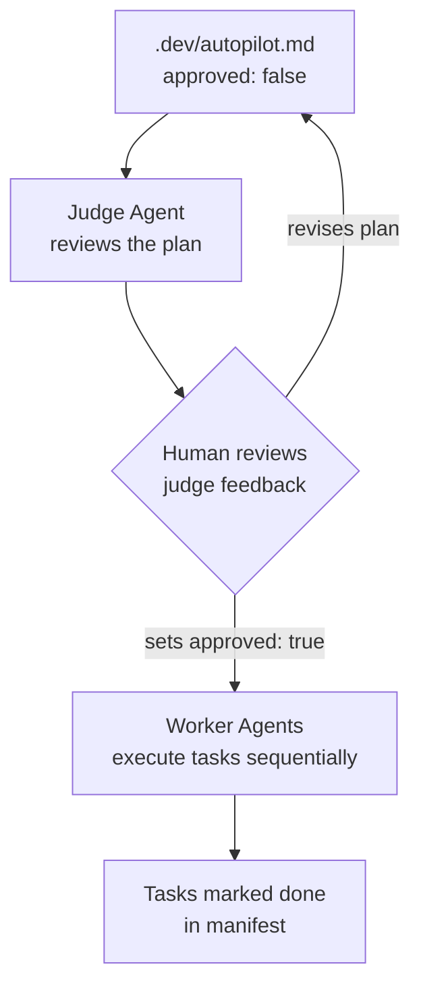

# I got tired of being my own cron job

Every evening I'd open Claude Code, type "continue with the plan," approve a few tool calls, and go to bed. Next morning: same routine. I was the cron job.

The tasks were clear. The agent was capable. The only bottleneck was me showing up to press Enter.

So I built `autopilot` — a thin orchestrator that handles the outer loop, with one human gate that actually matters.

---

## The Problem: The Human Cron Job

Here's the pattern I kept falling into with hobby projects:

1. Open Claude Code
2. Type something like "continue implementing the auth system from the plan"
3. Watch it work, approve tool calls
4. Close laptop
5. Come back tomorrow and repeat from step 1

This isn't supervision. I wasn't providing judgment or catching errors in real time. I was just *scheduling* — manually telling the agent when to start and stopping it when I went to bed. The work itself was fine. The agent knew what to do. The manifest was clear. There was no real value in a human doing this outer loop.

But full autonomy felt uncomfortable too. What if it deletes the database? What if it runs up a $200 API bill chasing a bug in circles? What if it makes a sweeping architectural change I'd never actually sanction?

The problem isn't automation vs. control. It's *where* the control lives.

Manual scheduling — showing up to press Enter — is not meaningful control. It's just friction. Meaningful control is reviewing a plan before execution begins, setting budget limits, and deciding what kinds of changes are in scope.

---

## What Autopilot Does: One Gate That Matters

The design centers on a single human checkpoint: manifest approval.



The flow:

1. You write a manifest — a markdown file with YAML frontmatter and a task list
2. `autopilot` runs the **judge agent**, which reads the manifest and gives structured feedback: are the tasks atomic? Are there missing dependencies? Does the budget seem right for the scope?
3. You read the feedback, revise if needed, and set `approved: true`
4. **Worker agents** execute tasks sequentially, no further human input required

The judge never auto-approves. Period. That's a hard rule. Once you've set `approved: true`, tasks run until they're done (or hit the retry limit). You can leave. That's the point.

Your actual job: write a good plan, read the judge's feedback, decide if you agree. That's it. That's the whole outer loop.

### A Real Manifest

```yaml
---
name: "Fix authentication bug"
approved: true
max_budget_usd: 5.00
max_task_attempts: 3
---

## Tasks

### [ ] audit-auth-flow
Read auth middleware and identify the session expiry bug.

### [ ] fix-session-expiry [depends: audit-auth-flow]
Patch the session expiry logic. Write a regression test.

### [ ] update-docs [depends: fix-session-expiry]
Update the auth section of the README.
```

`max_budget_usd` caps total agent spend for the session. `max_task_attempts` limits retries per task. `depends` wires up a simple DAG — the worker won't attempt `fix-session-expiry` until `audit-auth-flow` is marked done.

---

## The Manifest-as-Docs Pattern

The manifest format is deliberately simple: YAML frontmatter for config, markdown checkboxes for tasks. No database, no external state, no dashboard to check.

When a task starts, autopilot writes inline metadata directly into the checkbox line:

```markdown
### [ ] audit-auth-flow [attempts: 1]
```

When it succeeds:

```markdown
### [x] audit-auth-flow
```

When it fails:

```markdown
### [ ] fix-session-expiry [status: failed] [error: tests failing after patch, see worker output]
```

After a run, the manifest is simultaneously the original plan and a record of what happened. You can commit it. You can read it without opening a dashboard. If autopilot crashes or you kill it halfway through, the next run picks up exactly where it left off — the checkbox state is the ground truth.

This turned out to be one of the more satisfying design decisions. I initially considered SQLite for task state, but the markdown-inline approach means the manifest is both human-writable and machine-readable, survives any crash, and fits naturally into a `.dev/` folder that's already gitignored.

The pattern scales surprisingly well. A manifest for this v0.1.0 release sprint has 15 tasks with dependencies — it's a perfectly readable document that also serves as the spec.

---

## Modes Overview

Beyond the core task runner, autopilot has a few other modes that handle different parts of the dev loop.

**`--research .`** analyzes a project and writes `.dev/project-summary.md`. It understands the stack, architecture, maturity level, and what's likely blocking you from shipping. Useful even without a manifest — run it on any project you haven't touched in six months.

**`--plan .`** generates the manifest itself. It runs research first (lazily — skips it if the summary already exists), then runs a planner agent that writes `.dev/autopilot.md`. Pass `--review` to also run a critic agent that adversarially picks apart the plan. Pass `--context <file>` to seed the planner directly from your own notes instead of the research summary.

**`--roadmap .`** answers a different question: not "what tasks need doing" but "what should this project's shipping target actually be?" It produces `.dev/roadmap.md` — a concrete path to a defined done state (PyPI publish, blog post, production deploy, whatever makes sense).

**`--portfolio --scan ~/Projects`** runs across all your projects and produces a summary of which ones deserve attention, which are stale, and which are close to a milestone. It's a good weekly habit — lets you see the full picture without having to open each project individually.

The vision: `autopilot --research --scan ~/Projects` as a regular check-in. Your projects stay organized without requiring you to remember what state each one is in.

---

## What I Learned

### The agent SDK is shockingly simple

The Anthropic Agent SDK's core interface is `query()` — an async generator that streams message events. That's essentially the whole API surface. You pass it a prompt, allowed tools, and options; you iterate the stream and collect the result.

The complexity lives in your prompts. The SDK handles the mechanics of tool use, retries, and streaming. You're responsible for writing clear, unambiguous instructions. The judge agent's system prompt took the most iteration — it has to be strict enough to catch underspecified plans but not so strict that it demands perfection before approving anything reasonable.

### Manifests beat databases

Storing task state as inline bracket notation in a markdown file was a deliberate bet: trade sophistication for durability. It paid off. The manifest is human-readable, git-committable, crash-safe, and editable in any text editor. When something goes wrong, you can read exactly what happened without querying anything.

### Task atomicity is harder than it looks

Writing good tasks is a skill. A task that says "implement authentication" is too broad — the worker agent has no clear done condition. A task that says "add a `POST /login` endpoint that validates credentials against the users table and returns a session cookie; mark done when the existing auth tests pass" is something an agent can actually execute and verify.

The judge agent's main job is catching underspecified tasks before they become expensive failed attempts.

### Budget limits per task, not per session

Each worker agent gets its own budget cap (`max_budget_usd` divided across tasks, or set explicitly). This prevents runaway costs from a single task that goes in circles — the agent stops when it hits the limit rather than burning through the full session budget on one bad retry loop.

---

## Try It

```bash
pip install claude-autopilot
autopilot --research .
autopilot --plan .
# Read .dev/autopilot.md, edit if needed, set approved: true
autopilot .
```

The GitHub repo is at **github.com/timconnorz/claude-autopilot** — issues, PRs, and feedback all welcome.

Things still on the roadmap: webhook notifications when a run finishes, budget tracking across sessions, a config file for default agent settings, and proper smoke tests. The core loop works well enough that I've been using it to develop autopilot itself — this v0.1.0 sprint was planned and executed with autopilot running its own manifest.

If you've found yourself being your own cron job, give it a try. The outer loop should be automated. Your job is to write the plan.

---

## Cross-Posting Checklist

*(For human review and action after editing)*

- [ ] Review and edit draft
- [ ] Post to personal blog or dev.to
- [ ] Submit to Hacker News (Show HN: "Show HN: autopilot – autonomous project session orchestrator for Claude Code")
- [ ] Post to r/ClaudeAI or r/MachineLearning
- [ ] Add link to README: `> Read the blog post: [I got tired of being my own cron job](...)`
