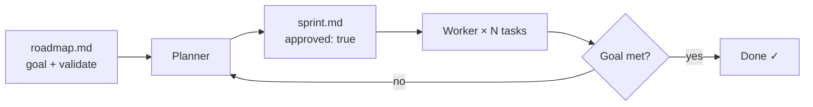

---
hide:
  - navigation
  - toc
---

# autopilot

**The outer loop for Claude Code.**

Stop being the human cron job. Describe what needs building — autopilot plans it, judges it, and runs it. Task by task, sprint by sprint, until the work is done.

---

<div class="card-grid">
<a class="card" href="guides/quick-start/">
<p class="card-title">Quick Start</p>
<p class="card-desc">Install, write your first task, and run it in minutes.</p>
</a>
<a class="card" href="guides/">
<p class="card-title">Guides</p>
<p class="card-desc">Walkthroughs for every workflow — from a single task to a fully autonomous sprint loop.</p>
</a>
<a class="card" href="reference/cli/">
<p class="card-title">CLI Reference</p>
<p class="card-desc">Every command, flag, and option with examples.</p>
</a>
<a class="card" href="reference/manifest-format/">
<p class="card-title">Manifest Format</p>
<p class="card-desc">Complete reference for sprint.md and roadmap.md syntax.</p>
</a>
</div>

---

## What it does

Claude Code can write code, run tests, fix bugs, and commit changes. What it can't do is decide what to work on next and keep going without you there.

That's autopilot's job.

You describe the goal. Autopilot figures out the tasks, runs Claude Code on each one, and checks whether the job is done. When something breaks, it retries. When the goal is met, it stops.

```bash
# Fully autonomous: roadmap → plan → sprint → evaluate → repeat
autopilot ralph .
```

Or stay in control at each step:

```bash
autopilot roadmap .     # Shape the goal
autopilot plan .        # Break it into tasks (you review and approve)
autopilot sprint .      # Execute
```

---

## Install

=== "pip"

    ```bash
    pip install claude-autopilot
    ```

=== "uv"

    ```bash
    uv pip install claude-autopilot
    ```

Requires [Claude Code](https://claude.ai/code) with a valid API key or subscription token.

---

## How it works



Each task spawns a fresh Claude Code session. The worker implements the work, commits, and marks the task done. Autopilot tracks retries, budget, and progress throughout.

Sessions appear in Claude Code's `/resume` history as `autopilot/projectname/role` — nothing disappears into a black box.

---

## Two modes

**Task execution** — Write a manifest, autopilot runs it. Good for well-defined work where you know the tasks upfront.

**Roadmap-driven sprints** — Describe a goal, autopilot figures out the tasks, runs sprints, and checks whether the goal has been met. Good for open-ended projects where the work evolves.

Both modes share the same `plan → sprint` core. `ralph` is just that loop run autonomously until the goal is met.
