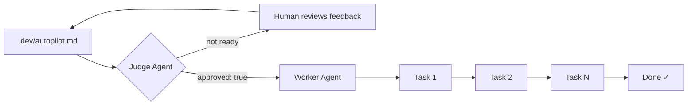

# autopilot

**Autonomous project session orchestrator for Claude Code.**

Stop being the human cron job. `autopilot` reads your project manifest, evaluates task readiness with an AI judge, and executes tasks sequentially through Claude Code — one session at a time, with your approval as the gate.

You write the plan. Autopilot runs it.

## Quick Start

```bash
pip install claude-autopilot

# Analyse your project (no manifest needed)
autopilot research .

# Generate a manifest from the analysis
autopilot plan .

# Review the generated manifest, then approve it
# Edit .dev/autopilot.md and set: approved: true

# Execute all tasks
autopilot .
```

## How It Works



Autopilot's core loop has two phases:

1. **Judge phase** — An LLM evaluates whether your manifest is coherent, complete, and safe to execute. It never auto-approves (unless you pass `--auto-approve`). You review the feedback and set `approved: true` when you're satisfied.
2. **Worker phase** — Tasks run sequentially. Each task spawns a fresh Claude Code session via the Anthropic Agent SDK. The worker marks tasks done by checking their checkboxes in the manifest.

Between runs, the manifest is your source of truth: it tracks which tasks are pending, in-progress, done, or failed. You can edit it at any time.

## Why autopilot?

Hobby projects stall because the outer loop — read notes, pick a task, fire up Claude, review, commit, repeat — is manual and tedious. Autopilot automates exactly that loop while keeping a human in the approval seat. The manifest-as-docs pattern means your plan is always readable, editable, and version-controllable.

## Quick Links

- [Getting Started](getting-started.md) — install, first manifest, full walkthrough
- [Manifest Format](manifest-format.md) — complete field reference
- [CLI Reference](cli-reference.md) — all flags with examples
- [Agent Roles](agent-roles.md) — judge, worker, planner, researcher, and more
- [GitHub](https://github.com/timainge/autopilot)
