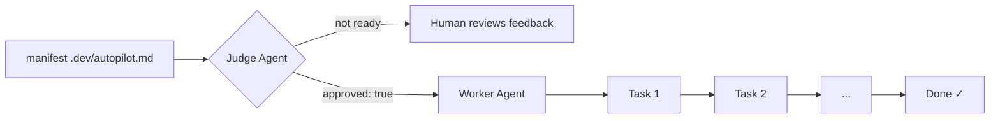

# autopilot

**Autonomous project session orchestrator for Claude Code.**

Stop being the human cron job. `autopilot` reads your project manifest, evaluates task readiness with an AI judge, and executes tasks sequentially through Claude Code — one session at a time, with your approval as the gate.

```bash
pip install claude-autopilot
autopilot /path/to/project
```

## How It Works



1. **Judge phase** — An LLM evaluates whether your manifest is ready to execute. It never auto-approves; you set `approved: true`.
2. **Worker phase** — Tasks execute sequentially. Each task spawns a fresh Claude Code session via the Anthropic Agent SDK.

## Quick Links

- [Getting Started](getting-started.md)
- [Manifest Format](manifest-format.md)
- [CLI Reference](cli-reference.md)
- [GitHub](https://github.com/timainge/autopilot)
